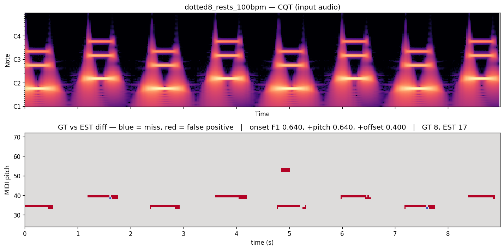
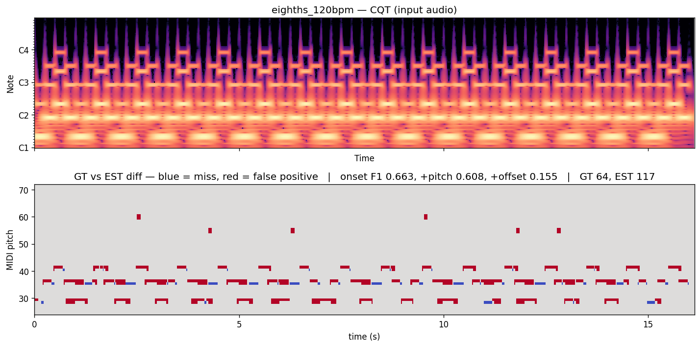
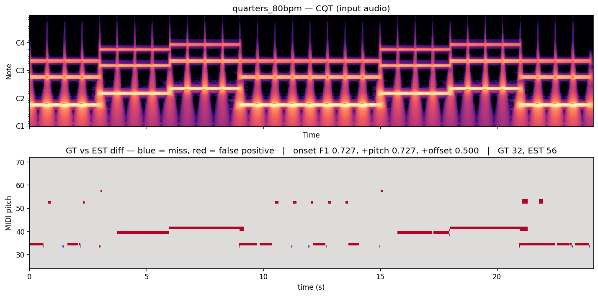
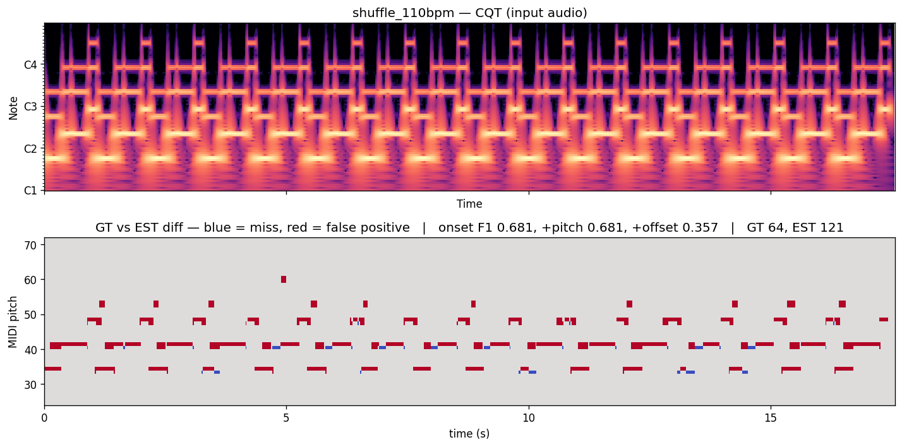
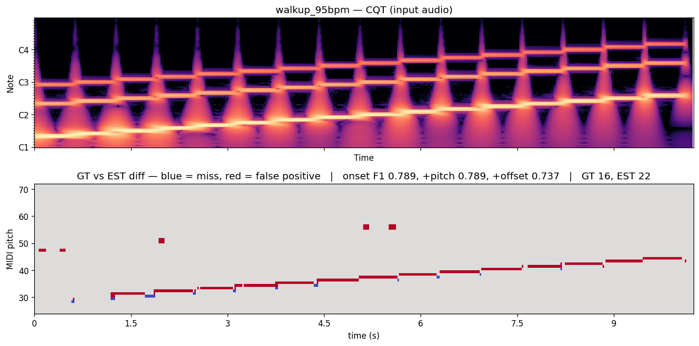

# Eval run — 2026-04-20T03-14-45Z

Mobile review checklist:
- [ ] mean onset F1 ≥ baseline (see prior run for the number)
- [ ] no clip regresses by > 0.05 F1
- [ ] tap two worst clips, scan their `roll.png` (blue = miss, red = false positive)
- [ ] download one `ab.wav`, listen on earbuds (L = input audio, R = predicted MIDI)

**Mean across 6 clips:** onset 0.621  |  +pitch 0.607  |  +offset 0.366

| clip | onset F1 | +pitch F1 | +offset F1 | n_gt | n_est | review |
|---|---:|---:|---:|---:|---:|---|
| dotted8_rests_100bpm | 0.640 | 0.640 | 0.400 | 8 | 17 |  [audio](dotted8_rests_100bpm/ab.wav) |
| eighths_120bpm | 0.663 | 0.608 | 0.155 | 64 | 117 |  [audio](eighths_120bpm/ab.wav) |
| quarters_80bpm | 0.727 | 0.727 | 0.500 | 32 | 56 |  [audio](quarters_80bpm/ab.wav) |
| shuffle_110bpm | 0.681 | 0.681 | 0.357 | 64 | 121 |  [audio](shuffle_110bpm/ab.wav) |
| sixteenths_100bpm | 0.222 | 0.198 | 0.049 | 64 | 17 |  [audio](sixteenths_100bpm/ab.wav) |
| walkup_95bpm | 0.789 | 0.789 | 0.737 | 16 | 22 |  [audio](walkup_95bpm/ab.wav) |
